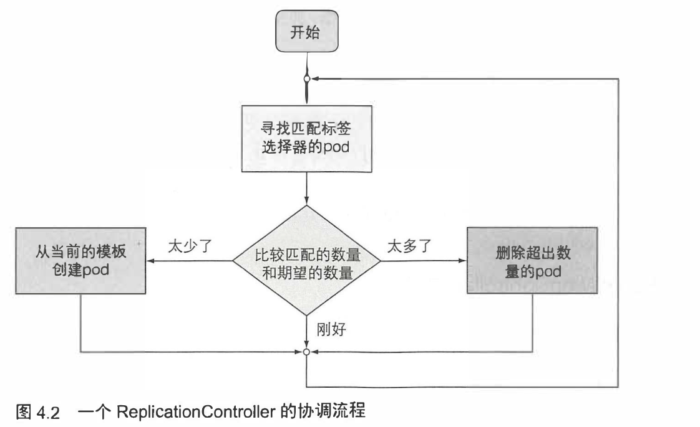
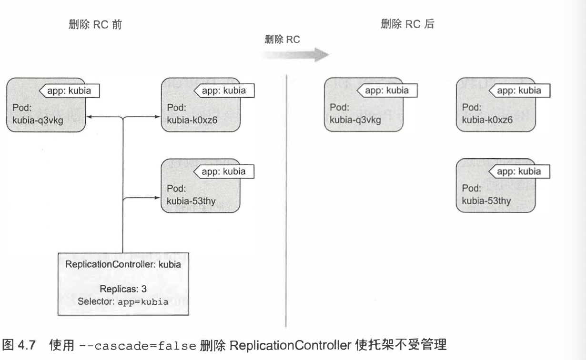
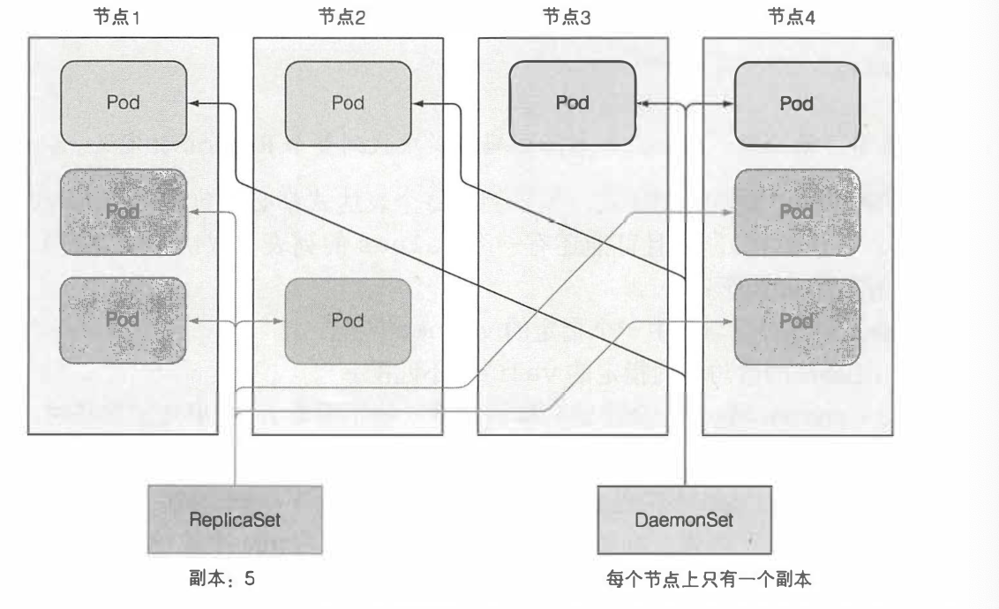

### pods

```yaml
apiVersion: v1
kind: Pod # P 要大写
metadata:
  name: mwish-bot
spec:
  containers:
  - image: redis
    name: mredis
    ports:
    - containerPort: 6379
      protocol: TCP
```

然后在这里可以：

```bash
kubectl create -f p.yaml
```

第一次 check 的时候：

```
➜  k8s kubectl get pods
NAME        READY   STATUS              RESTARTS   AGE
mwish-bot   0/1     ContainerCreating   0          55s
```

等镜像被拉下来就是 running 了。

```
➜  k8s kubectl get pods 
NAME        READY   STATUS    RESTARTS   AGE
mwish-bot   1/1     Running   0          6m2s
```

（这个时候 docker ps 竟然没有，不科学？）

然后可以看 log:

```
mwish-bot   1/1     Running   0          6m2s
➜  k8s kubectl logs mwish-bot
1:C 08 Feb 2020 19:17:28.146 # oO0OoO0OoO0Oo Redis is starting oO0OoO0OoO0Oo
1:C 08 Feb 2020 19:17:28.146 # Redis version=5.0.7, bits=64, commit=00000000, modified=0, pid=1, just started
1:C 08 Feb 2020 19:17:28.146 # Warning: no config file specified, using the default config. In order to specify a config file use redis-server /path/to/redis.conf
1:M 08 Feb 2020 19:17:28.153 * Running mode=standalone, port=6379.
1:M 08 Feb 2020 19:17:28.153 # WARNING: The TCP backlog setting of 511 cannot be enforced because /proc/sys/net/core/somaxconn is set to the lower value of 128.
1:M 08 Feb 2020 19:17:28.154 # Server initialized
1:M 08 Feb 2020 19:17:28.155 * Ready to accept connections
```

开启端口转发之后，就可以连接了：

```
 kubectl port-forward mwish-bot 6379:6379
```

然后：

```
redis-cli
```

可以操作。

我们可以拿到标签：

```
➜  k8s kubectl get pod --show-labels
NAME        READY   STATUS    RESTARTS   AGE   LABELS
mwish-bot   1/1     Running   0          10m   <none>
```

加上标签之后可以根据标签过滤：

```
➜  k8s kubectl get pods -L env 
NAME        READY   STATUS    RESTARTS   AGE   ENV
mwish-bot   1/1     Running   0          25s   prod
```

对于pod 还有 ns:

```
➜  k8s kubectl get po --namespace kube-system
NAME                               READY   STATUS    RESTARTS   AGE
coredns-d5947d4b-cxp4s             1/1     Running   1          38h
coredns-d5947d4b-czpwz             1/1     Running   1          38h
etcd-minikube                      1/1     Running   0          38h
kube-addon-manager-minikube        1/1     Running   0          38h
kube-apiserver-minikube            1/1     Running   0          38h
kube-controller-manager-minikube   1/1     Running   0          38h
kube-proxy-jcvd4                   1/1     Running   0          38h
kube-scheduler-minikube            1/1     Running   0          38h
storage-provisioner                1/1     Running   0          38h
```


* ns
* selector
* 你可以给固定节点打 tag

你可以用来给 node 打 tag, 比如 `gpu = true` , 便于调度。

## Probe

用于检测。其实你可以看看 redis 的 k8s-yaml 

实际上有个 livenessProbe，例如：

https://github.com/spotahome/redis-operator/blob/89d5715fe74842e81b870ed6522949316a08dcdf/operator/redisfailover/service/generator.go#L282

这里会让 redis cli 去 ping. 实际上应用 OOM 之类的可能容器还在，但是服务事实上是不可用的。可能有的还会在 http 上绑定 `/health`

### ReplicaContoller

> ReplicationController是一种Kubemetes资源，可确保它的pod始终保持运行状态。 如果pod因任何原因 消失(例如节点从集群中消失或由于该pod已从节点中逐出)， 则ReplicationController 会注意到缺少了pod并创建替代pod。

* 对于没有 rc 甚至什么都没有的， node 挂了就真的挂了
* 有托管的话，会创建一个新的 replica.

ReplicationController会持续监控正在运行的pod列表， 并保证相应 ” 类型” 的 pod的数目与期望相符。 如正在运行的pod太少， 它会根据pod模板创建新的副本。 如正在运行的pod太多， 它将删除多余的副本。 

ReplicationController 不是根据pod类型来执行 操作的， 而是根据pod是否匹配某个标签选择器(前 一 章 中了解了它们)。




包括的内容有：

* label selector
* count 
* pod template

它能:

* 确保 一 个 pod (或多个 pod 副本)持续运行， 方法是在现有 pod 丢失时启动 一 个新 pod。

* 集群节点发生故障时， 它将为故障节 点 上运 行的所有 pod (即受 ReplicationController 控制的节点上的那些 pod) 创建替代副本。
* 它能轻松实现 pod的水平伸缩 手动和自动都可以(参见第 15 章中的 pod的水平自动伸缩)。

\(pod 实例永远不会重新安置到另一个节点。 相反， ReplicationController 会 创建一个全新的 pod 实例， 它与正在替换的实例无关。\)

可以通过 scale 等方式扩展 replica set.

下面我们创建了一个 ReplicationController:

```yaml
➜  k8s cat p-rc.yaml 
apiVersion: v1
kind: ReplicationController
metadata:
  name: rs-mwish-bot
spec:
  replicas: 3
  selector:
    app: mwish-bot
  template:
    metadata:
      labels:
        app: mwish-bot
    spec:
      containers:
      - name: mwish-bot
        image: redis
        ports:
        - containerPort: 6379
```

apply 之后可以 get pods :

```
➜  k8s kubectl get pods          
NAME                 READY   STATUS    RESTARTS   AGE
mwish-bot            1/1     Running   0          8m15s
rs-mwish-bot-fh8j8   1/1     Running   0          2m55s
rs-mwish-bot-q4ntt   1/1     Running   0          2m55s
```

让我们 delete 原来的 pod 吧：

```
➜  k8s kubectl get pods          
NAME                 READY   STATUS    RESTARTS   AGE
mwish-bot            1/1     Running   0          8m15s
rs-mwish-bot-fh8j8   1/1     Running   0          2m55s
rs-mwish-bot-q4ntt   1/1     Running   0          2m55s
➜  k8s kubectl delete pod mwish-bot
pod "mwish-bot" deleted
➜  k8s kubectl get pods
NAME                 READY   STATUS         RESTARTS   AGE
rs-mwish-bot-5ld94   0/1     ErrImagePull   0          20s
rs-mwish-bot-fh8j8   1/1     Running        0          3m41s
rs-mwish-bot-q4ntt   1/1     Running        0          3m41s
➜  k8s 
```

（为什么会 ErrImagePull...\)

```
➜  k8s kubectl get pods
NAME                 READY   STATUS    RESTARTS   AGE
rs-mwish-bot-5ld94   1/1     Running   0          50s
rs-mwish-bot-fh8j8   1/1     Running   0          4m11s
rs-mwish-bot-q4ntt   1/1     Running   0          4m11s
```

好了，恢复了。

我们看看 rc :

```
➜  k8s kubectl get rc
NAME           DESIRED   CURRENT   READY   AGE
rs-mwish-bot   3         3         3       5m7s
```

由于我们是按照标签来的，所以我们 overwrite 一下标签，有趣的就来了：

```
➜  k8s kubectl label pod rs-mwish-bot-5ld94 app=nmsl --overwrite
pod/rs-mwish-bot-5ld94 labeled
➜  k8s kubectl get pods
NAME                 READY   STATUS              RESTARTS   AGE
rs-mwish-bot-5ld94   1/1     Running             0          7m35s
rs-mwish-bot-fh8j8   1/1     Running             0          10m
rs-mwish-bot-q4ntt   1/1     Running             0          10m
rs-mwish-bot-tvpr7   0/1     ContainerCreating   0          5s
```

下面我们再试试更改 scale, 你当然可以更新它的 yaml 文件，不过你更可以：

```
➜  k8s kubectl scale rc rs-mwish-bot --replicas=5
replicationcontroller/rs-mwish-bot scaled
➜  k8s kubectl get pods
NAME                 READY   STATUS              RESTARTS   AGE
rs-mwish-bot-5ld94   1/1     Running             0          20m
rs-mwish-bot-fh8j8   1/1     Running             0          23m
rs-mwish-bot-nbtfr   0/1     ContainerCreating   0          6s
rs-mwish-bot-pvfg9   0/1     ContainerCreating   0          6s
rs-mwish-bot-q4ntt   1/1     Running             0          23m
rs-mwish-bot-tvpr7   1/1     Running             0          12m
```


----


kubectl delete 删除 ReplicationController 时， pod 也会被删除。 但是由于由 ReplicationController 创建的 pod 不是 ReplicationController 的组成部分， 只是由其进行管理， 因此可以只删除 ReplicationController 并保待 pod 运行



ReplicaSet 是 rc 的升级版，不是 v1 的一部分。提供了更强的选择器。但是目前我不介绍吧。ReplicationController 应该替换为 ReplicaSet 和 Deployment, 它们提供类似的功能和更强的能力。

### DeamonSet



你可以看到现有的 DeamonSet:

```
➜  k8s kubectl get ns
NAME              STATUS   AGE
chaos-testing     Active   23h
default           Active   23h
kube-node-lease   Active   23h
kube-public       Active   23h
kube-system       Active   23h
➜  k8s kubectl get ds    
No resources found.
➜  k8s kubectl get ds -n kube-system
NAME                       DESIRED   CURRENT   READY   UP-TO-DATE   AVAILABLE   NODE SELECTOR   AGE
kube-proxy                 1         1         1       1            1           <none>          23h
local-volume-provisioner   1         1         1       1            1           <none>          23h
➜  k8s 
```

> • 执行批处理任务的 pod 应通过 Kubernetes Job 资源创建， 而不是直接或通过
>
> ReplicationController 或类似对象创建。
>  • 需要在未来某个时候运行的 Job 可以通过 CronJob 资源创建。

Job 这几节我就简单看了下, 假设：

* 你有一个运行中的集群
* 你希望运行一个测试脚本

比如说我们希望对一个 tidb 的数据库集群跑 go-tpc https://github.com/pingcap/go-tpc:

```dockerfile
FROM golang:alpine3.10 AS build_base

RUN apk add --no-cache gcc make bash git curl

ENV GO111MODULE=on
RUN mkdir /src
WORKDIR /src
COPY go.mod .
COPY go.sum .

RUN go mod download

COPY . .

RUN make build

FROM alpine:3.8

RUN apk update && apk upgrade && \
    apk add --no-cache bash curl wget

COPY --from=0 /src/bin/* /bin/
```

这个时候，我们把这个 dockerfile 编译成镜像然后 push 到 docker.io 之后，可以写一个对应的 yaml 来描述 job:

```yaml
apiVersion: batch/v1
kind: Job
metadata:
  name: run-go-tpc
  namespace: mwish-1k-test
spec:
  template: 
    metadata:
      name: run-go-tpc
    spec:
      containers:
      - name: run-go-tpc
        image: mwish117/mwish-go-tpc
        command: ["/bin/go-tpc", "tpcc", "-H", "10.23.255.222", "--warehouses", "1000", "-T", "200", "run"]
      restartPolicy: Never
```

它会创建一个 `"${run-go-tpc}-${random}"` 的名字, 然后运行这个 Job.