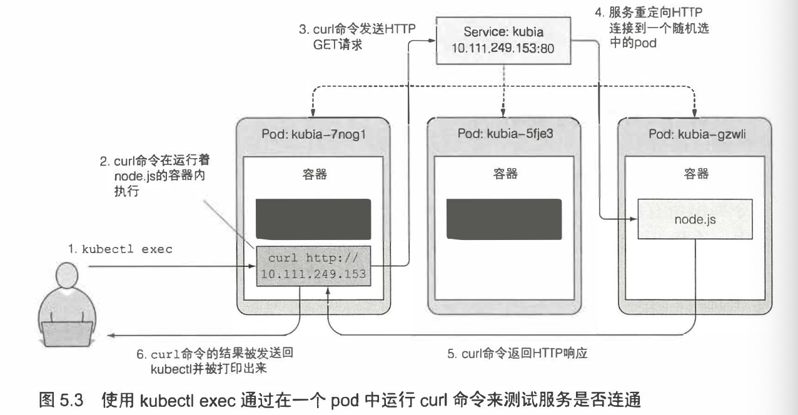
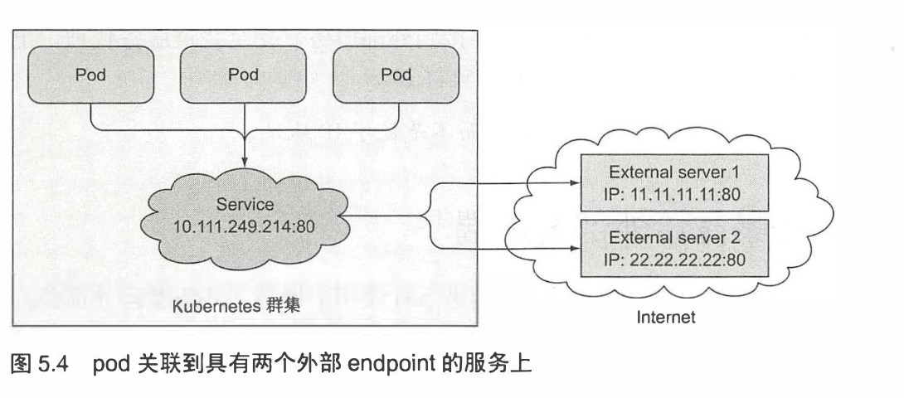
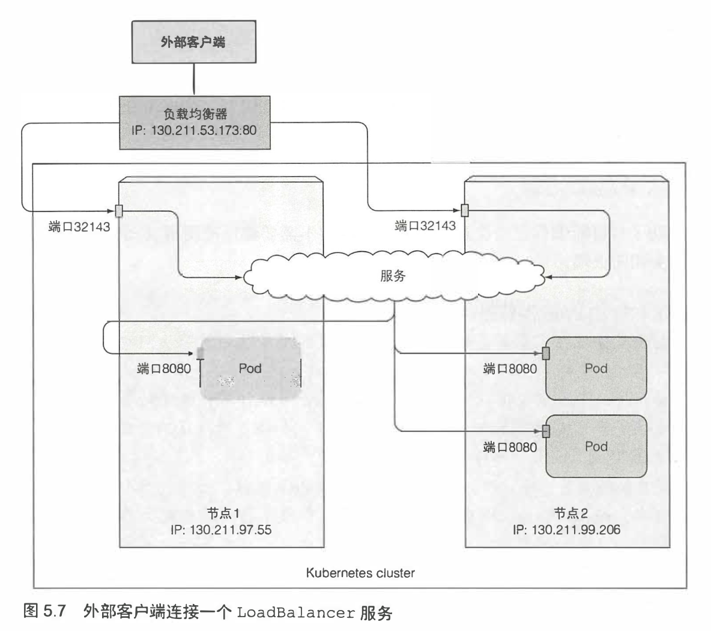
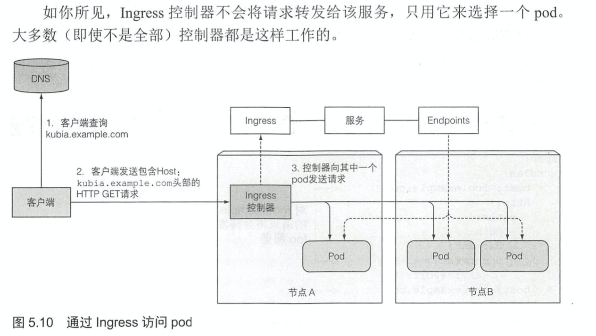

# k8s service

## 解决的问题

* Pod 资源可能是短暂的
* ip 直到 Pod 开始运行，可能是不确定的
* `ReplicaSet` 等设定让 `Pod` 可能一组 pod 维护一个功能。

我们需要：

* caller side 能直接连接上 pod
* 后台变化的时候，暴露的接口保持不变

### Service

```yaml
➜  k8s cat p-svc.yaml 
apiVersion: v1
kind: Service
metadata:
  name: mwish-bot-svc
spec:
  ports:
  - port: 9527
    targetPort: 6379
  selector:
    app: mwish-bot
```

create 之后我们去捞一下 service:

```
➜  k8s kubectl create -f p-svc.yaml 
service/mwish-bot-svc created
➜  k8s kubectl get svc
NAME            TYPE        CLUSTER-IP       EXTERNAL-IP   PORT(S)    AGE
kubernetes      ClusterIP   10.96.0.1        <none>        443/TCP    24h
mwish-bot-svc   ClusterIP   10.110.119.160   <none>        2379/TCP   3m18s
```

> 可以通过以下几种方法向服务发送请求:
>
> * 显而易见的方法是 创建一个pod, 它将请求发送到服务的集群IP并记录响应。
> * 可以通过查看pod日志检查服务的响应。
> * 使用ssh远程 登录到其中 一 个Kubemetes节点上， 然后使用curl命令。 
> * 可以通过kubectl exec命令在一个已经存在的pod中执行 curl命令。 我们来学习最后一 种方法-�如何在已有的pod中运行命令。

来吧

```
➜  ~ kubectl get pods                              
NAME        READY   STATUS    RESTARTS   AGE
mwish-bot   1/1     Running   0          59m
➜  ~ kubectl exec mwish-bot -- redis-cli get nmsl

➜  ~ kubectl exec mwish-bot -- redis-cli set nmsl 10
OK
➜  ~ kubectl exec mwish-bot -- redis-cli get nmsl   
10
➜  ~ 
```

（这个超好玩啊喂）可以 curl 到对应服务，然后下列操作也可以在容器中运行 shell:

```bash
kubectl exec -it rs-mwish-bot-t4ffk bash
```

实际上，bash 在不同镜像里可能要以不同的形式（比如 /bin/sh 等别的形式访问），甚至有的镜像是没有 bash 的，需要注意一下。

我们也可以复习一下 `port-forward`

```bash
kubectl port-forward mwish-bot 6379:6379 
```

然后本地 `redis-cli` 也有效。

这个时候注意下一个问题，那就是 https://kubernetes.io/docs/tasks/debug-application-cluster/debug-service/#a-pod-fails-to-reach-itself-via-the-service-ip ，可能下面的步骤你要再开一个 Pod.

```bash
➜  k8s git:(master) ✗ kubectl get pods
NAME                READY   STATUS    RESTARTS   AGE
mwish-bot           1/1     Running   0          33m
mwish-bot-another   1/1     Running   0          3m55s
➜  k8s git:(master) ✗ kubectl exec mwish-bot-another -- redis-cli -h 10.104.193.224  get nmsl
123241
```

现在我们可以根据 `ClusterIP` 访问集群内部了。

那么以上 `p-svc.yaml` 原理可以从书上抄图片：




>  另 一方面，如果希望特定客户端产生的所有请求每次都指向同 一个 pod, 可以 设置服务的 sessionAffinity属性为 ClientIP (而不是 None,None 是默认值)，如下面的代码所示。
>
> ```
> apiVersion: vl kind: Service spec:
> sessionAffinity: ClientIP
> ```

## 客户端的服务发现

`env` 能够列出所有的环境变量，让我们试图在客户端 Pod 里运行它：

```bash
➜  k8s git:(master) ✗ kubectl exec mwish-bot-another -- env                                  
PATH=/usr/local/sbin:/usr/local/bin:/usr/sbin:/usr/bin:/sbin:/bin
HOSTNAME=mwish-bot-another
MWISH_BOT_SERVICE_HOST=10.104.193.224
MWISH_BOT_PORT_6379_TCP_PROTO=tcp
MWISH_BOT_PORT_6379_TCP_ADDR=10.104.193.224
KUBERNETES_PORT_443_TCP_ADDR=10.96.0.1
MWISH_BOT_SVC_REDIS_SERVICE_HOST=10.98.79.92
MWISH_BOT_SVC_REDIS_PORT=tcp://10.98.79.92:6379
MWISH_BOT_SVC_REDIS_PORT_6379_TCP_PROTO=tcp
MWISH_BOT_SVC_REDIS_PORT_6379_TCP_PORT=6379
MWISH_BOT_PORT=tcp://10.104.193.224:6379
MWISH_BOT_PORT_6379_TCP=tcp://10.104.193.224:6379
MWISH_BOT_PORT_6379_TCP_PORT=6379
KUBERNETES_SERVICE_PORT_HTTPS=443
MWISH_BOT_SVC_REDIS_SERVICE_PORT=6379
MWISH_BOT_SVC_REDIS_PORT_6379_TCP=tcp://10.98.79.92:6379
MWISH_BOT_SVC_REDIS_PORT_6379_TCP_ADDR=10.98.79.92
MWISH_BOT_SERVICE_PORT=6379
KUBERNETES_PORT_443_TCP_PORT=443
MWISH_BOT_SVC_REDIS_SERVICE_PORT_REDIS_PORT=6379
KUBERNETES_SERVICE_HOST=10.96.0.1
KUBERNETES_SERVICE_PORT=443
KUBERNETES_PORT=tcp://10.96.0.1:443
KUBERNETES_PORT_443_TCP=tcp://10.96.0.1:443
KUBERNETES_PORT_443_TCP_PROTO=tcp
GOSU_VERSION=1.11
REDIS_VERSION=5.0.8
REDIS_DOWNLOAD_URL=http://download.redis.io/releases/redis-5.0.8.tar.gz
REDIS_DOWNLOAD_SHA=f3c7eac42f433326a8d981b50dba0169fdfaf46abb23fcda2f933a7552ee4ed7
HOME=/root
```

好多熟悉的我们创建的 svc 和 Pod，这里我们再看看

```bash
MWISH_BOT_SVC_REDIS_SERVICE_PORT=6379
MWISH_BOT_SVC_REDIS_PORT_6379_TCP=tcp://10.98.79.92:6379
MWISH_BOT_SVC_REDIS_PORT_6379_TCP_ADDR=10.98.79.92
```

```bash
➜  k8s git:(master) ✗ kubectl get svc
NAME                  TYPE        CLUSTER-IP       EXTERNAL-IP   PORT(S)    AGE
kubernetes            ClusterIP   10.96.0.1        <none>        443/TCP    4h2m
mwish-bot             ClusterIP   10.104.193.224   <none>        6379/TCP   3h31m
mwish-bot-svc-redis   ClusterIP   10.98.79.92      <none>        6379/TCP   3h43m
```

是不是对上了？

还可以使用 dns：

* https://kubernetes.io/docs/concepts/services-networking/dns-pod-service/
* https://github.com/kubernetes/dns/blob/master/docs/specification.md#231---aaaaa-record

它通过一个 dns 的 service 访问

```bash
➜  k8s git:(master) ✗ kubectl get pods -n kube-system
NAME                               READY   STATUS    RESTARTS   AGE
coredns-d5947d4b-l95d8             1/1     Running   1          4h6m
coredns-d5947d4b-wxc4g             1/1     Running   1          4h6m
```

按照上面的规则，可以：

```bash
➜  k8s git:(master) ✗ kubectl exec mwish-bot-another -- redis-cli -h mwish-bot-svc-redis.default.svc.cluster.local  get nmsl
123241
```

如果有问题的话，可以访问一下之前的链接看看。

然后比较具体的部分可以看这个链接： https://kubernetes.io/docs/concepts/services-networking/service/#virtual-ips-and-service-proxies

### Endpoint

实际上，EndPoint 可以把信息暴露给外部服务：https://kubernetes.io/docs/concepts/services-networking/service/#services-without-selectors

我们 describe 的时候可以发现：

```bash
➜  k8s kubectl describe svc mwish-bot-svc-redis
Name:              mwish-bot-svc
Namespace:         default
Labels:            <none>
Annotations:       <none>
Selector:          app=mwish-bot
Type:              ClusterIP
IP:                10.105.85.34
Port:              redis-port  9527/TCP
TargetPort:        6379/TCP
Endpoints:         172.17.0.6:6379,172.17.0.7:6379,172.17.0.8:6379
Session Affinity:  None
Events:            <none>
```

然后：

```
➜  k8s git:(master) ✗ kubectl get endpoints                   
NAME                  ENDPOINTS                           AGE
kubernetes            192.168.99.100:8443                 4h30m
mwish-bot             172.17.0.4:6379,172.17.0.5:6379     3h59m
mwish-bot-svc-redis   11.11.11.11:6379,22.22.22.22:6379   4h11m
```

我们可以配置这个 endpoint:

```yaml
apiVersion: v1
kind: Endpoints
metadata:
  name: mwish-bot-svc-redis
subsets:
  - addresses:
    - ip: 11.11.11.11
    - ip: 22.22.22.22
    ports:
    - port: 6379
```

同时，也可以使用 `external-name`



### 暴露给外部

之前我们介绍 Job 的时候，我们的需求是：

> 我可能起了一个 k8s 集群，然后我希望运行一个 benchmark 来测试该集群的稳定性。

那么我们如果起一个外部访问的话，那么这个 bench 将收到网络延迟的影响，显然这不是预期的结果（虽然网络延迟无处不在），所以我们可能会期望打进去。现在可能的需求是：

> 我有一套前端服务，前面挂了个 nginx，我总要暴露给外部吧！

解决方案是：https://kubernetes.io/docs/concepts/services-networking/service/#publishing-services-service-types

* NodePort/LoadBalance
* Ingress

准备一个

```yaml
apiVersion: v1
kind: Service
metadata:
    name: mwish-bot-nodeport
spec:
    type: NodePort
    ports:
    - port: 6379
      nodePort: 31234
    selector:
        app: mwish-bot
```

可以拿到

```bash
➜  k8s git:(master) ✗ kubectl get svc
NAME                 TYPE        CLUSTER-IP     EXTERNAL-IP   PORT(S)          AGE
kubernetes           ClusterIP   10.96.0.1      <none>        443/TCP          8h
mwish-bot-nodeport   NodePort    10.97.123.16   <none>        6379:31234/TCP   6s
```

`NodePort` 和 `node` 是相关的，在每个 node 上它绑定了 `31234` 端口，便于访问。由于我本人使用 minikube 本地测试，所以根据这个：https://stackoverflow.com/questions/44112150/external-ip-for-kubernetes-shows-nodes-in-minikube

```
➜  k8s git:(master) ✗ minikube ip
192.168.99.100
```

我们试试：

```bash
➜  k8s git:(master) ✗ redis-cli -h 192.168.99.100 -p 31234 get nmsl
(nil)
```

HAHAHA\(其实也可以用 `minikube service`)

### LoadBalancer

LoadBalancer 提供一个固定的 IP, 选定一个端口，我觉得它类似在 NodePort 前面挂了个 LoadBalance



## Ingress

https://kubernetes.io/docs/concepts/services-networking/ingress/

Ingress 在 Http 层为一组 service 提供接口，同时提供 session affinity 等功能

它需要在有 ingress controller 的集群中运行

我应该在 minikube 上开启 ingress:

```
➜  k8s git:(master) ✗ minikube addons list
- addon-manager: enabled
- dashboard: disabled
- default-storageclass: enabled
- efk: disabled
- freshpod: disabled
- gvisor: disabled
- heapster: disabled
- ingress: disabled
- logviewer: disabled
- metrics-server: disabled
- nvidia-driver-installer: disabled
- nvidia-gpu-device-plugin: disabled
- registry: disabled
- registry-creds: disabled
- storage-provisioner: enabled
- storage-provisioner-gluster: disabled
```

```
➜  k8s git:(master) ✗ minikube addons enable ingress
✅  ingress was successfully enabled
```

然后看看：

```
➜  k8s git:(master) ✗ kubectl get po -n kube-system | grep ingress
nginx-ingress-controller-586cdc477c-t22vl   0/1     ContainerCreating   0          44s
```

看来是你在捣鬼：https://github.com/kubernetes/ingress-nginx



### headless

我希望：假设我有个 sb-redis, 对一组 redis 试图执行同样的操作，来构建一个 redis 集群。然后这个集群能够按需 scale，那么，很显然，我有个需求是：

* 知道所有 redis 的 Pod 的网络访问地址

那么，可以看到 headless 提供了这样的支持：

> 幸运的是， Kubemetes 允许客户通过 DNS 查找发现 pod IP。 通常， 当执行服 务的 DNS 查找时， DNS 服务器会返回单个 IP一服务的集群 IP。 但是， 如果告诉 Kubemetes, 不需要为服务提供集群 IP (通过在服务 spec 中将 clusterIP 字段设 置为 None 来完成此操作)， 则 DNS 服务器将返回 pod IP 而不是单个服务 IP。
>
> DNS 服务器不会返回单个 DNS A记录， 而是会为该服务返回多个A记录， 每 个记录指向当时支持该服务的单个pod的IP。 客户端因此可以做一个简单的DNSA 记录查找并获取属于该服务一部分的所有 pod 的 IP。 客户端可以使用该信息连接到 其中的一个、 多个或全部。

> Sometimes you don’t need load-balancing and a single Service IP. In this case, you can create what are termed “headless” Services, by explicitly specifying `"None"` for the cluster IP (`.spec.clusterIP`).
>
> You can use a headless Service to interface with other service discovery mechanisms, without being tied to Kubernetes’ implementation.
>
> For headless `Services`, a cluster IP is not allocated, kube-proxy does not handle these Services, and there is no load balancing or proxying done by the platform for them. How DNS is automatically configured depends on whether the Service has selectors defined:

然后可以借助 dns 访问 Pod.